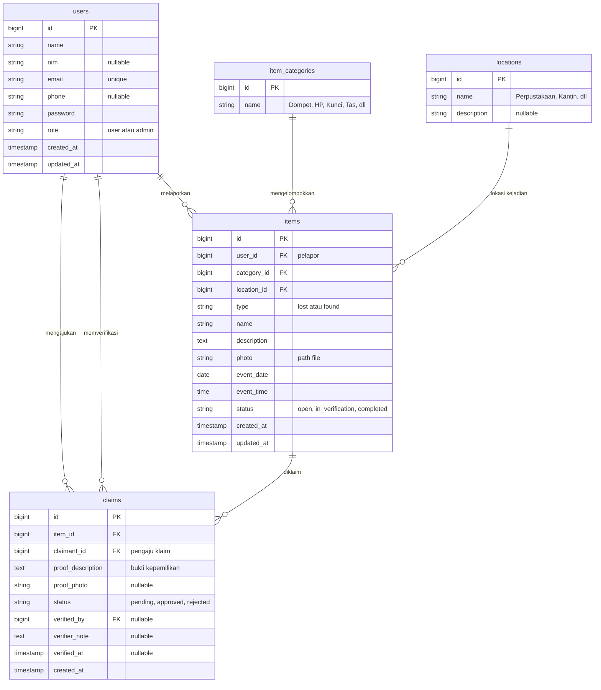

# ERD LostFound

```mermaid
erDiagram
    users ||--o{ items : "melaporkan"
    users ||--o{ claims : "mengajukan"
    users ||--o{ claims : "memverifikasi"
    item_categories ||--o{ items : "mengelompokkan"
    locations ||--o{ items : "lokasi kejadian"
    items ||--o{ claims : "diklaim"

    users {
        bigint id PK
        string name
        string nim "nullable"
        string email "unique"
        string phone "nullable"
        string password
        string role "user atau admin"
        timestamp created_at
        timestamp updated_at
    }

    item_categories {
        bigint id PK
        string name "Dompet, HP, Kunci, Tas, dll"
    }

    locations {
        bigint id PK
        string name "Perpustakaan, Kantin, dll"
        string description "nullable"
    }

    items {
        bigint id PK
        bigint user_id FK "pelapor"
        bigint category_id FK
        bigint location_id FK
        string type "lost atau found"
        string name
        text description
        string photo "path file"
        date event_date
        time event_time
        string status "open, in_verification, completed"
        timestamp created_at
        timestamp updated_at
    }

    claims {
        bigint id PK
        bigint item_id FK
        bigint claimant_id FK "pengaju klaim"
        text proof_description "bukti kepemilikan"
        string proof_photo "nullable"
        string status "pending, approved, rejected"
        bigint verified_by FK "nullable"
        text verifier_note "nullable"
        timestamp verified_at "nullable"
        timestamp created_at
    }
```